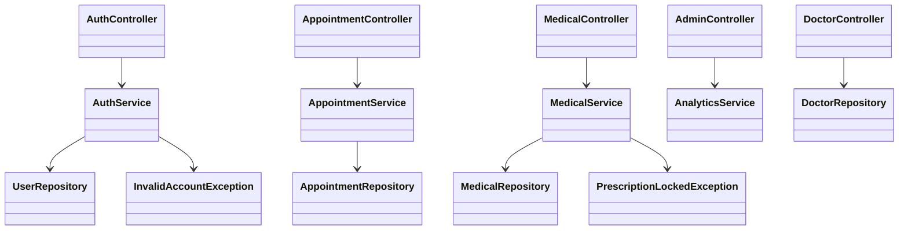

# Class Diagram

```mermaid
classDiagram
  class AuthController
  class DoctorController
  class AppointmentController
  class MedicalController
  class AdminController
  class AuthService
  class AppointmentService
  class MedicalService
  class AnalyticsService
  class UserRepository
  class DoctorRepository
  class AppointmentRepository
  class MedicalRepository
  class InvalidAccountException
  class PrescriptionLockedException

  AuthController --> AuthService
  DoctorController --> DoctorRepository
  AppointmentController --> AppointmentService
  MedicalController --> MedicalService
  AdminController --> AnalyticsService
  AuthService --> UserRepository
  AppointmentService --> AppointmentRepository
  MedicalService --> MedicalRepository
  MedicalService --> PrescriptionLockedException
  AuthService --> InvalidAccountException
```
