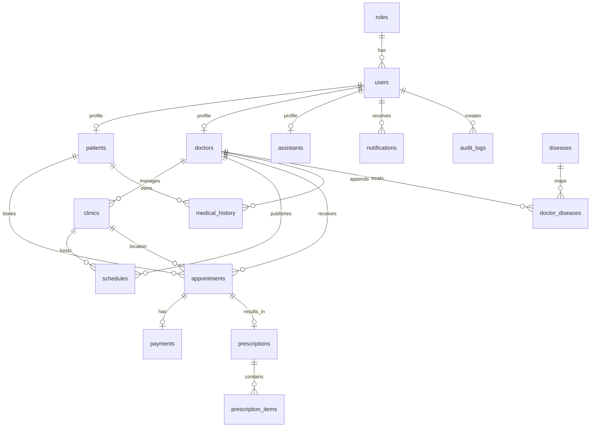

# ER Diagram

```mermaid
erDiagram
  roles ||--o{ users : has
  users ||--o| patients : profile
  users ||--o| doctors : profile
  users ||--o| assistants : profile
  doctors ||--o{ clinics : manages
  doctors ||--o{ schedules : publishes
  clinics ||--o{ schedules : hosts
  patients ||--o{ appointments : books
  doctors ||--o{ appointments : receives
  clinics ||--o{ appointments : location
  appointments ||--o| payments : has
  appointments ||--o| prescriptions : results_in
  prescriptions ||--o{ prescription_items : contains
  patients ||--o{ medical_history : owns
  doctors ||--o{ medical_history : appends
  users ||--o{ notifications : receives
  users ||--o{ audit_logs : creates
  diseases ||--o{ doctor_diseases : maps
  doctors ||--o{ doctor_diseases : treats
```
