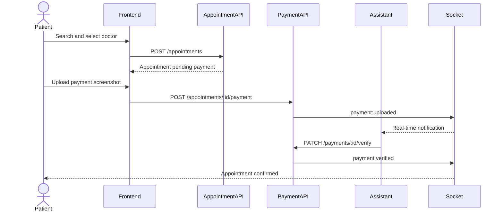
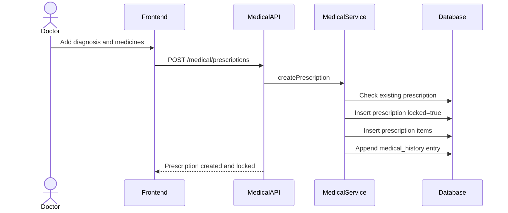

# Sequence Diagrams

## Book Appointment and Verify Payment

```mermaid
sequenceDiagram
  actor Patient
  participant Frontend
  participant AppointmentAPI
  participant PaymentAPI
  participant Assistant
  participant Socket
  Patient->>Frontend: Search and select doctor
  Frontend->>AppointmentAPI: POST /appointments
  AppointmentAPI-->>Frontend: Appointment pending payment
  Patient->>Frontend: Upload payment screenshot
  Frontend->>PaymentAPI: POST /appointments/:id/payment
  PaymentAPI->>Socket: payment:uploaded
  Socket-->>Assistant: Real-time notification
  Assistant->>PaymentAPI: PATCH /payments/:id/verify
  PaymentAPI->>Socket: payment:verified
  Socket-->>Patient: Appointment confirmed
```

## Create Prescription

```mermaid
sequenceDiagram
  actor Doctor
  participant Frontend
  participant MedicalAPI
  participant MedicalService
  participant Database
  Doctor->>Frontend: Add diagnosis and medicines
  Frontend->>MedicalAPI: POST /medical/prescriptions
  MedicalAPI->>MedicalService: createPrescription
  MedicalService->>Database: Check existing prescription
  MedicalService->>Database: Insert prescription locked=true
  MedicalService->>Database: Insert prescription items
  MedicalService->>Database: Append medical_history entry
  MedicalAPI-->>Frontend: Prescription created and locked
```
