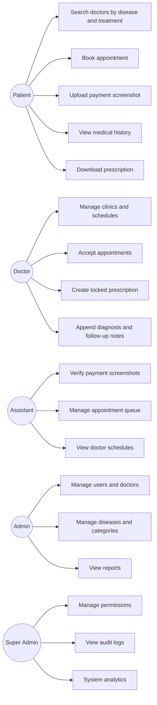

# Use Case Diagram

```mermaid
flowchart LR
  Patient((Patient))
  Doctor((Doctor))
  Assistant((Assistant))
  Admin((Admin))
  SuperAdmin((Super Admin))

  Patient --> Search[Search doctors by disease and treatment]
  Patient --> Book[Book appointment]
  Patient --> UploadPayment[Upload payment screenshot]
  Patient --> ViewHistory[View medical history]
  Patient --> DownloadRx[Download prescription]

  Doctor --> ManageClinic[Manage clinics and schedules]
  Doctor --> Accept[Accept appointments]
  Doctor --> CreateRx[Create locked prescription]
  Doctor --> Append[Append diagnosis and follow-up notes]

  Assistant --> VerifyPay[Verify payment screenshots]
  Assistant --> ManageQueue[Manage appointment queue]
  Assistant --> ViewSchedule[View doctor schedules]

  Admin --> ManageUsers[Manage users and doctors]
  Admin --> ManageDiseases[Manage diseases and categories]
  Admin --> Reports[View reports]

  SuperAdmin --> Permissions[Manage permissions]
  SuperAdmin --> Audit[View audit logs]
  SuperAdmin --> Analytics[System analytics]
```
