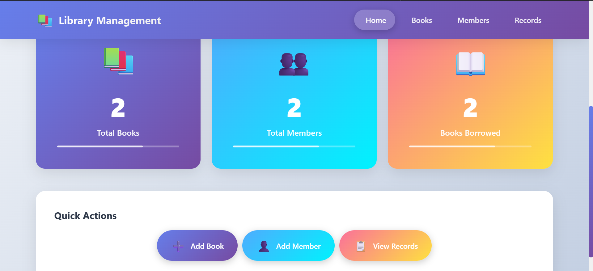
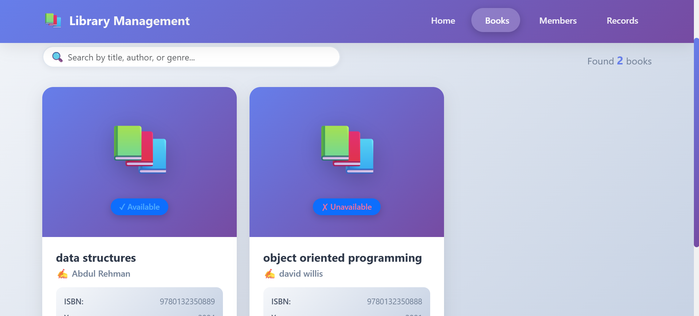
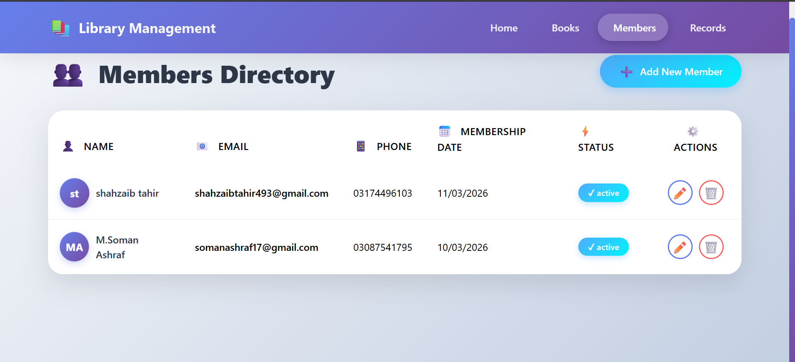
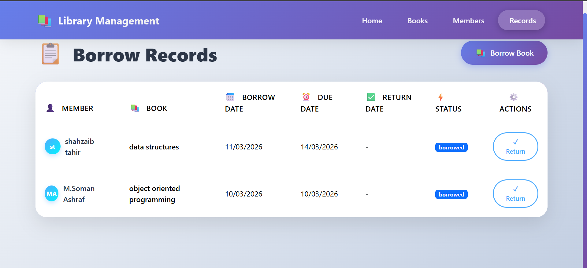

# 📚 Library Management System

A full-stack **MERN Stack** application for managing library books, members, and borrowing records with a modern responsive UI.


---

## 📸 Screenshots

### Home Page



### Books Page


### Members Page


### Borrow Records Page


---

##   Tech Stack

| Layer | Technology |
|-------|-----------|
| Frontend | React.js 18, Bootstrap 5, Axios |
| Backend | Node.js, Express.js |
| Database | MongoDB, Mongoose |
| Routing | React Router DOM 6 |

---

## ✨ Features

- 📖 Book Management — Add, edit, delete, search books
- 👥 Member Management — Register and manage members
- 📋 Borrow & Return — Complete checkout/return workflow
- 📊 Dashboard — Real-time statistics
-   Responsive — Works on all screen sizes

-   

---

## 📁 Project Structure

```
library-management-system/
├── backend/
│   ├── controllers/    # Business logic
│   ├── models/         # MongoDB models (Book, Member, BorrowRecord)
│   ├── routes/         # API routes
│   ├── .env            # Environment variables
│   └── server.js       # Entry point
├── frontend/
│   ├── src/
│   │   ├── components/ # Navbar
│   │   ├── pages/      # Home, Books, Members, BorrowRecords
│   │   └── services/   # Axios API calls
│   └── package.json
└── package.json
```

---

##   Setup & Installation

**Prerequisites:** Node.js, MongoDB

```bash
# 1. Install all dependencies
npm run install-all

# 2. Create backend/.env file
PORT=5000
MONGODB_URI=mongodb://localhost:27017/library_management
NODE_ENV=development

# 3. Start MongoDB (Windows)
net start MongoDB

# 4. Run the project
npm run dev
```

- Frontend: http://localhost:3000
- Backend API: http://localhost:5000/api

---

## 📡 API Endpoints

```
# Books
GET    /api/books
POST   /api/books
PUT    /api/books/:id
DELETE /api/books/:id

# Members
GET    /api/members
POST   /api/members
PUT    /api/members/:id
DELETE /api/members/:id

# Borrow Records
GET    /api/borrow-records
POST   /api/members/:memberId/borrowed-books
PUT    /api/members/:memberId/borrowed-books/:recordId
```

---

##   Common Issues

| Error | Solution |
|-------|----------|
| MongoDB connection refused | Run `net start MongoDB` |
| Port 5000 in use | Change `PORT` in `backend/.env` |
| Module not found | Run `npm install` in backend/frontend |

---

## 👨‍💻 Author

**Soman Ashraf** — MERN Stack Project

**Made with ❤️ By Soman Ashraf
